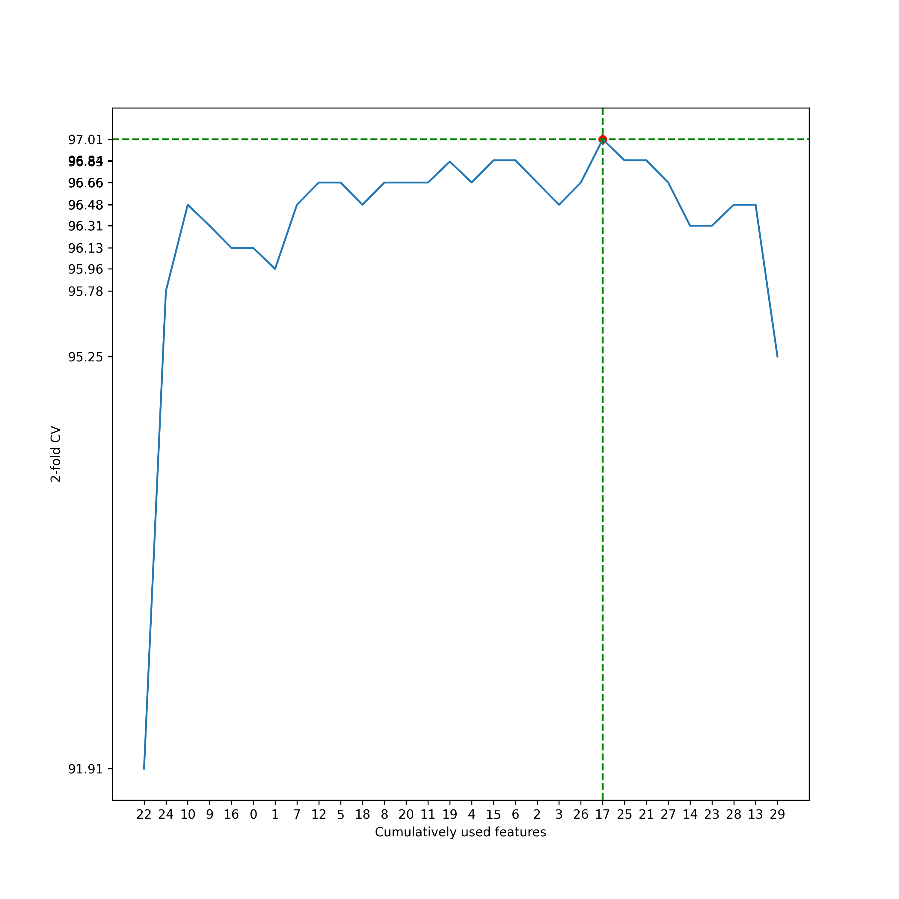
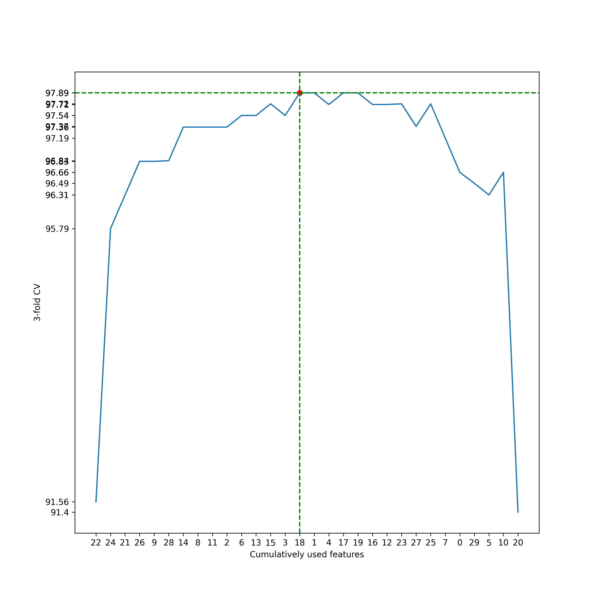
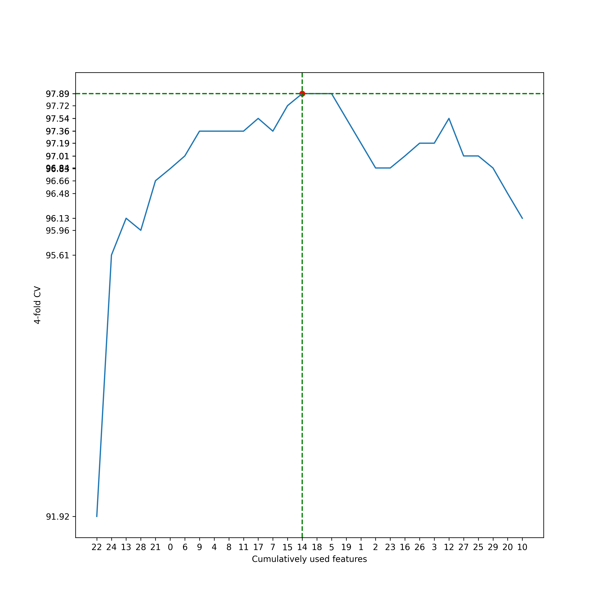
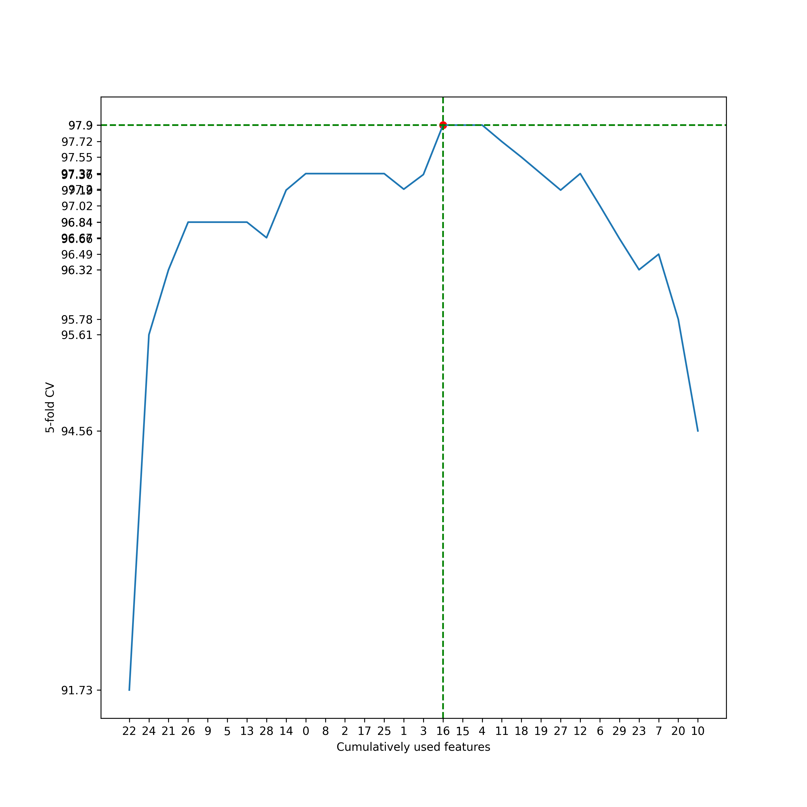
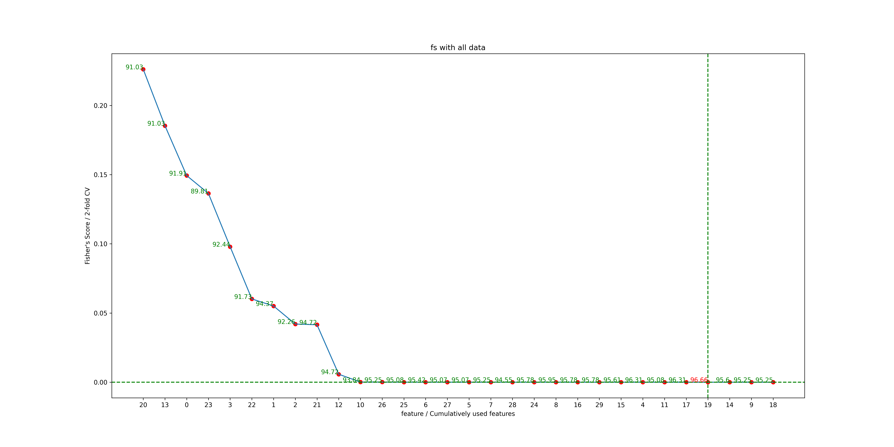
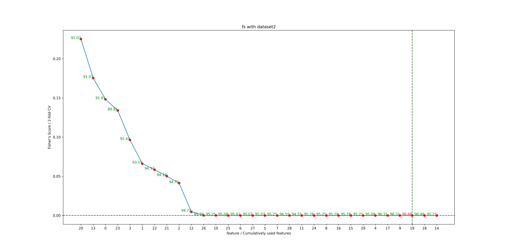

# HW5 312512063
## Part1: Sequential Forward Selection, SFS

    
    
    
    

## Part2: Fisher’s Criterion

    

    
    

## Part3：Discussion and results presenting
### 1 
Sequential Forward Selection (SFS) 屬於 Wrapper-based 特徵篩選方法，而 Fisher's Criterion 通常被用作 Filter-based 特徵篩選方法。

### 2 

 Filter-based 和 Wrapper-based 特徵篩選方法各有不同的性質和優缺點： 

Filter-based 特徵篩選方法：

 優點：

計算效率高，不需要訓練模型，可以快速篩選特徵。
獨立於具體機器學習模型，通常適用於各種算法。
可以在初始階段快速過濾掉明顯無關的特徵。

 缺點： 

忽略了特徵之間的相互關係，可能無法捕捉到特徵的互動作用。
難以處理特徵選擇的問題，因為它不考慮後續模型性能。

 Wrapper-based 特徵篩選方法： 

 優點： 

考慮了特徵之間的互動作用，能夠更準確地找到對模型性能有影響的特徵。
可以使用特定的機器學習模型來評估特徵子集的性能，因此更能找到最佳特徵組合。

缺點：

計算成本高，因為需要訓練多個模型來評估特徵子集的性能，特別是當特徵維度很高時。
容易過度擬合，因為在篩選特徵時使用了與最終模型相同的算法，可能在訓練集上表現良好但泛化性能差。
需要大量的計算資源和時間。

### 3
在本次作業的結果中，如果有使用 Sequential Forward Selection (SFS) 作為特徵篩選方法，則是一致的，因為SFS是Wrapper-based方法。如果使用了Fisher's Criterion作為特徵篩選方法，則是一致的，因為Fisher's Criterion通常被歸類為Filter-based方法。

原因分析:

如果在作業中使用了SFS，那麼在Wrapper-based方法下，它會考慮特徵之間的互動作用，可能會找到對模型性能有影響的最佳特徵組合。同樣，如果使用了Fisher's Criterion，它則是一種Filter-based方法，可能會快速篩選出具有較高相關性的特徵，但忽略了特徵之間的互動作用。因此，作業的結果會反映出所選擇的特徵篩選方法所帶來的影響，這與前述的特徵篩選方法的性質和優缺點是一致的。
