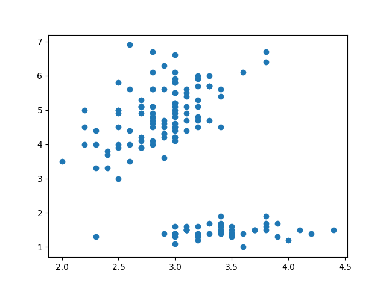
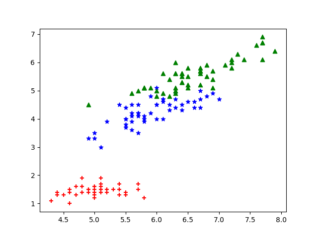
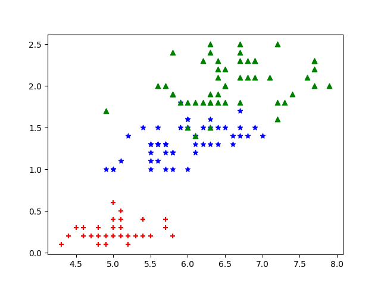
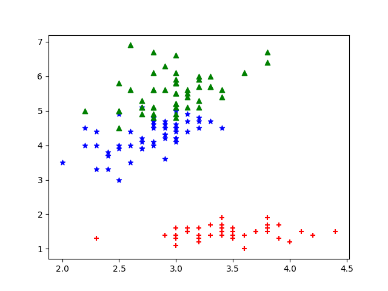
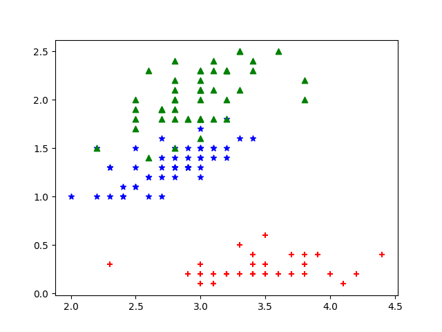
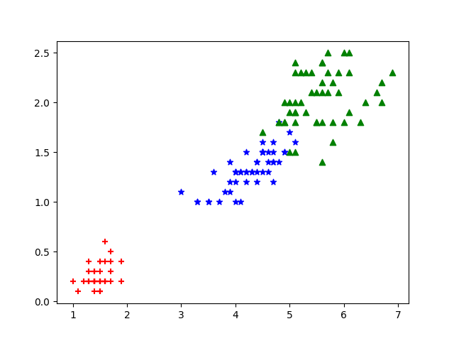

# hw1 KNN
## 312512063 張祐維
這次作業是寫出KNN分類器的程式。從2維特徵圖表可以看到除了1跟2的特徵組合外其他的特徵組合的label的族群都分的很明顯，可以預測在使用2種特徵下做KNN分類率會偏高，而後面KNN train出來的分類率也與預測一樣，除了1跟2的特徵組合外其他的特徵組合分類率都有80%以上。  
原先作業在只取1特徵時所有的分類率皆是33.33%，對照參考答案後發現有問題，去檢查後發現在算距離時，特徵抓出來算距離時data type是list因此距離算出來有問題。

## plot

 
分類率表格的0-14分別為C4-1 + C4-2 + C4-3 + C4-4 依照由小到大的方式排列。
