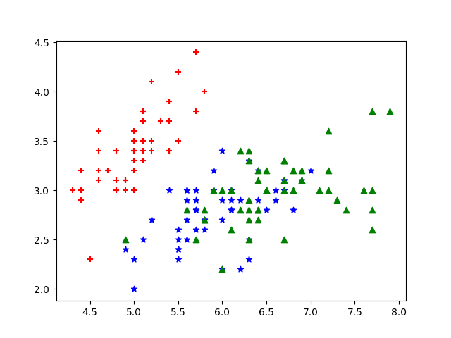

# hw1 KNN
## 312512063 張祐維
這次作業是寫出KNN分類器的程式。從2維特徵圖表可以看到除了1跟2的特徵組合外其他的特徵組合的label的族群都分的很明顯，可以預測在使用2種特徵下做KNN分類率會偏高，而後面KNN train出來的分類率也與預測一樣，除了1跟2的特徵組合外其他的特徵組合分類率都有80%以上。  
原先作業在只取1特徵時所有的分類率皆是33.33%，對照參考答案後發現有問題，去檢查後發現在算距離時，特徵抓出來算距離時data type是list因此距離算出來有問題。

## plot

 
## 分類率
|   feature  | k=1  |  k=3|
| :-----| ----: | :----: |
|1   |52.66  |65.34|
|2   |45.34  |52.00|
|3   |94.00  |92.00|
|4   |91.34  |95.34|
|12  | 71.33 | 74.66|
|13  | 93.33  |93.34|
|14  |87.34  |94.00|
|23   |92.00  |92.00|
|24   |93.34  |95.33|
|34   |95.33  |95.34|
|123  |92.66  |92.66|
|124  |92.66  |90.66|
|134 | 94.66  |95.34|
|234 | 96.67  |97.33|
|1234|  94.67 | 94.00|
