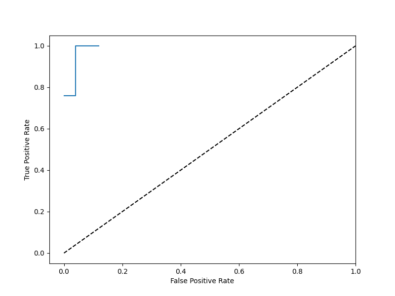
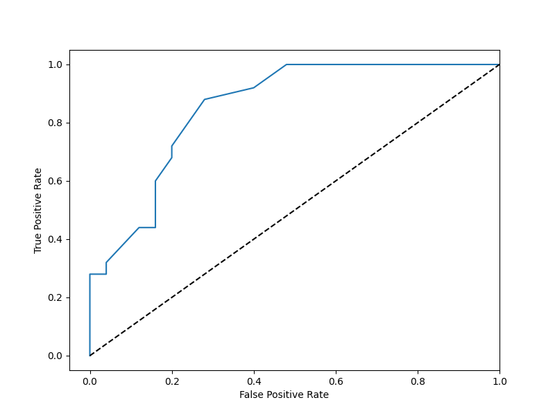
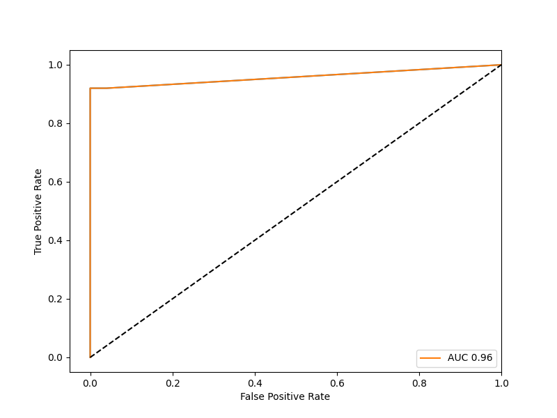

# LDA-HW2
## 312512063_張祐維
### (1)分類器實現

上次作業沒有把資料用class包起來，在運算時發生了很多data type對不到的問題 </b>
所以這次就用class 包起來希望不會再有data type對不到的問題。</b>
本次作業要用到矩陣計算但由於對numpy不熟悉所以只好自己打了一個矩陣dot，但只能用在2個feature的情況下。還好沒有使用更多的特徵了。 </b>

### (2)利用2-fold cross validation推估LDA在二元分類之分類率

### (3)繪製ROC與計算AUC

#### step1's ROC

#### step2's ROC

#### step3's ROC
