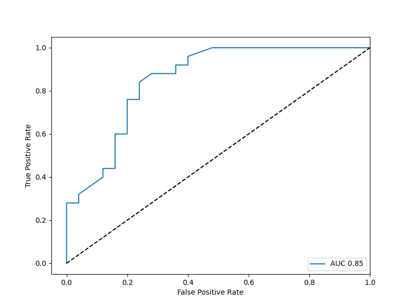

# LDA-HW2
## 312512063_張祐維
### (1)分類器實現

上次作業沒有把資料用class包起來，在運算時發生了很多data type對不到的問題 </b>
所以這次就用class 包起來希望不會再有data type對不到的問題。</b>
本次作業要用到矩陣計算但由於對numpy不熟悉所以只好自己打了一個矩陣dot，但只能用在2個feature的情況下。還好沒有使用更多的特徵了。 </b>

### (2)利用2-fold cross validation推估LDA在二元分類之分類率
| step  |weight       |bias    |validation|
| :-----| ----:       | ----:  | :----:   |
|step2  |[-1.39,  0.06]|8.58    |74.00     |
|step4  |[-2.48, -1.19]|18.89   |70.00     |
|step5  |none         |none    |72.00     |
### (3)繪製ROC與計算AUC
| step  |weight       |bias    |
| :-----| ----:       | :----: |
|step1  |[-4.97, -6.49,  8.15, 14.77]|-15.78|
|step2  |[ 1.39, -0.06]|-8.58  |
|step3  |[ 2.09, 10.46]|-28.12 |

#### step1's ROC

#### step2's ROC

#### step3's ROC

