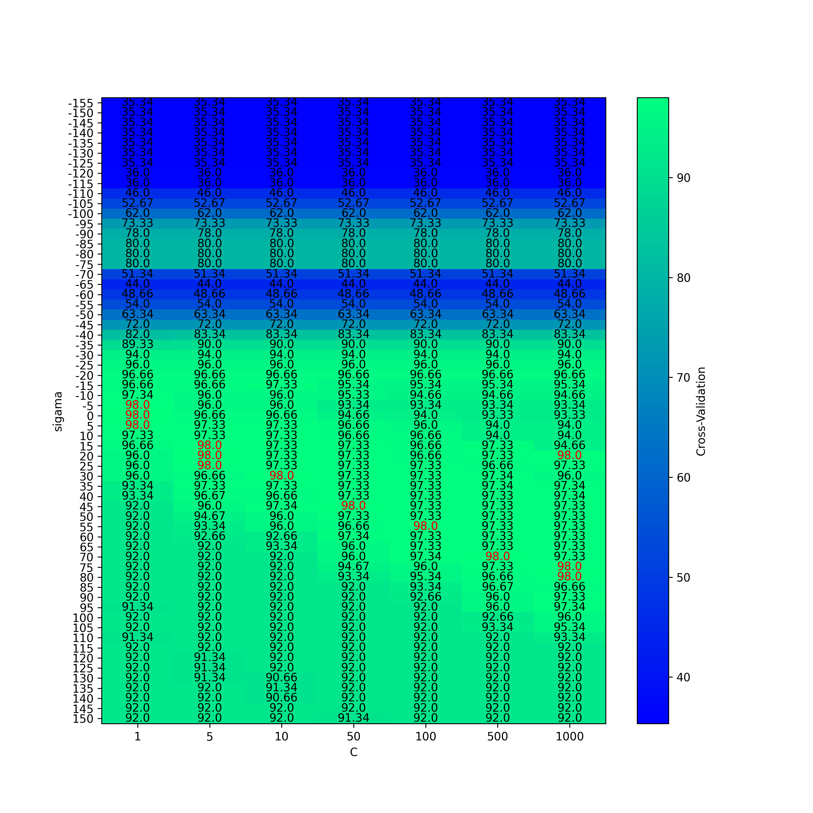
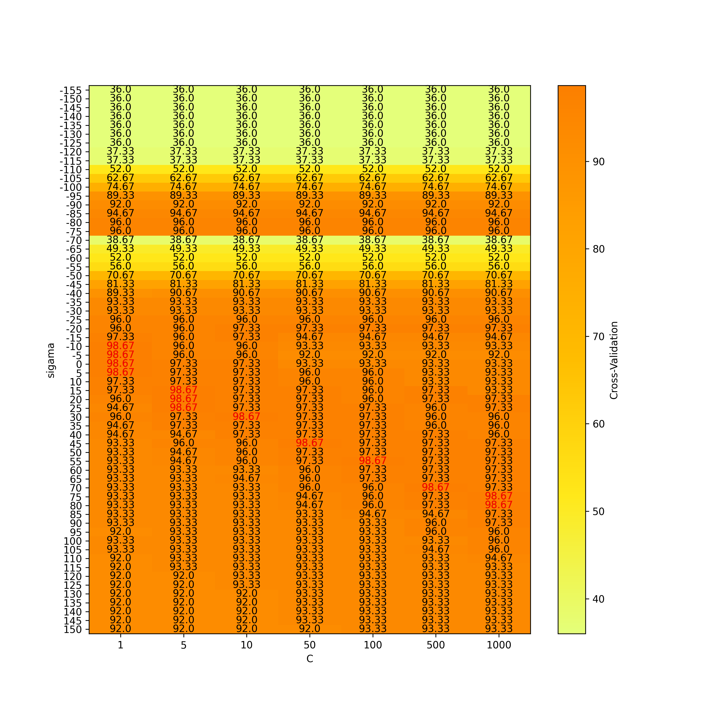

# HW4
## 312512063 張祐維

# Grid Search

<figure>
    
    <figcaption align='center'>2-fold-CV</figcaption>
</figure>

## non-fold CV

    
    

# Discussion
## 1.請問在grid search的結果中,C的大小與分類率高低有何關係?
## 2.sigma的大小的改變與分類率是否有關係? 若有,請探討sigma的差異與特徵的數值有什麼關聯性?
## 3.若分析過程不採用two-fold cross validation，則分類率是否會更高? 請探討之。
